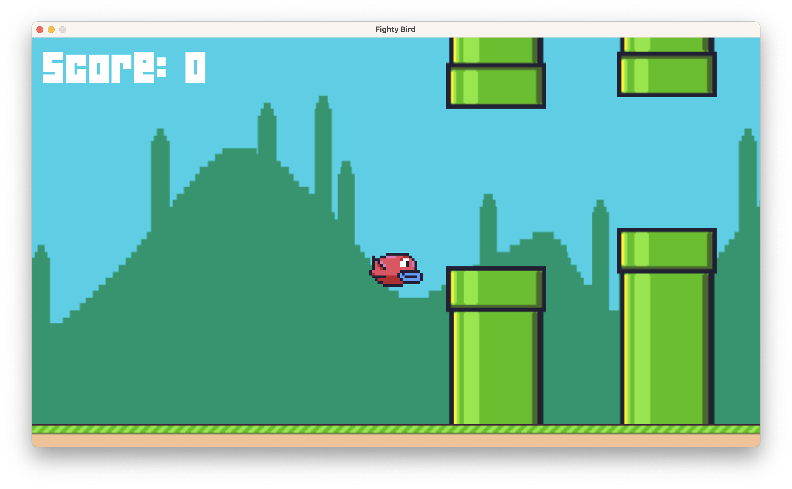

# CS50GameDev-flappy-bird

This repository contains a version of the Flappy bird game.
This project was created based on CS50's Introduction to Game Development course.



- [Original repo](https://github.com/games50/fifty-bird)
- [YouTube lecture](https://youtu.be/3IdOCxHGMIo)
- [Course link](https://learning.edx.org/course/course-v1:HarvardX+CS50G+Games/home)

The game is written in Lua using the LÖVE 2D game engine.

## Prerequisites

Before running the game, you need to install the LÖVE 2D game engine. Here are the installation guides based on your operating system:

1. 'Windows': [LÖVE for Windows](https://love2d.org/#download)
2. 'MacOS': [LÖVE for MacOS](https://love2d.org/#download)
3. 'Ubuntu': Use the terminal command `sudo apt-get install love`

## Getting Started

To play the game, you will first need to clone or download this repository to your local system.

```
git clone https://github.com/shanginn/CS50GameDev-flappy-bird.git
```

After downloading, navigate into the project directory.

```
cd CS50GameDev-flappy-bird
```

## Running the Game

To start the game, you need to run LÖVE 2D in the project's directory. 

Use the terminal to navigate to the project directory, then run the following command:

```
love .
```

This will start the game.

## Controls

`Space` to jump :)

To start the game, press Space.
